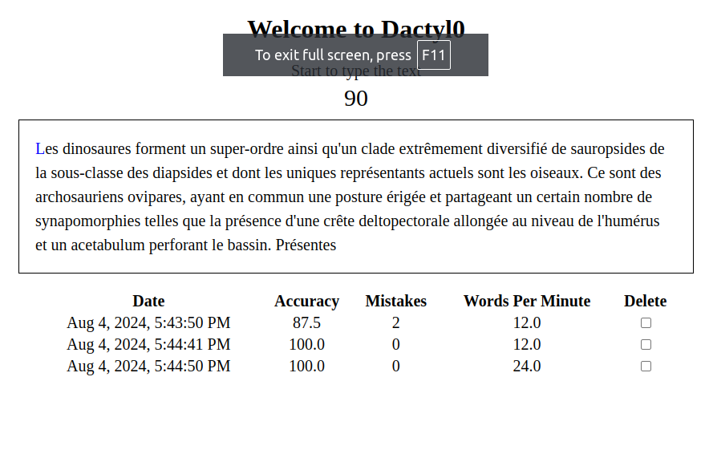

# Dactyl0
Single page web application to practice typing texts (on the keyboard).

**Texts are in french**, but, you can change them!

## Start the application (development mode)
1. Clone this repository
```
https://github.com/info7tik/dactylo.git
```
2. Install nodeJS and Angular
```
https://angular.dev/tools/cli/setup-local
```
3. Start the project
```
cd dactylo
npm start
```
4. Open the link [http://localhost:4200](http://localhost:4200)

## Screenshot


## Additional notes
When we use the application, scores are saved in our web clients (firefox, chrome, etc.).
So, scores are local data which means they are stored on our computers.
If we delete the `Cookies and other site data`, as Chrome refers to them, the scores will be deleted!

## Deploy the application with Docker
Prerequisite:
* [Install docker](https://docs.docker.com/engine/install/)
* [Install nodeJS](https://nodejs.org/en/download/package-manager)

*Note: the following commands must be run from the root directory which is the directory including the [docker](./docker/) directory*

1. Clone this repository
```
https://github.com/info7tik/dactylo.git
```

2. Build the application
```
npx ng build
```
This should generate the `dist` directory.

3. Build the container image
```
docker build -t dactyl0 -f docker/dactylo.dockerfile .
```
This should generate the `dactyl0` docker images (use `docker images` to see the images).

4. Start the container
```
docker run --name dactyl0 --rm -d -p8080:80 dactyl0
```
This should start the HTTP server. The application is available at [http://localhost:8080](http://localhost:8080).

The options are:
* `--name dactyl0`: set the name of the container
* `--rm`: delete the container when it stops
* `-d`: run as daemon
* `-p8080:80`: bind the HTTP server to the local port 8080

The application can be removed/uninstalled with the following command `docker stop dactyl0`.
To remove the docker image, run `docker image rm dactyl0`.